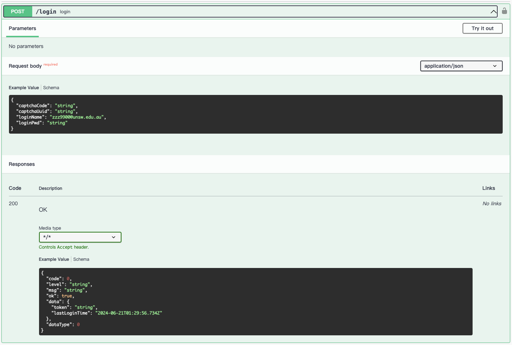
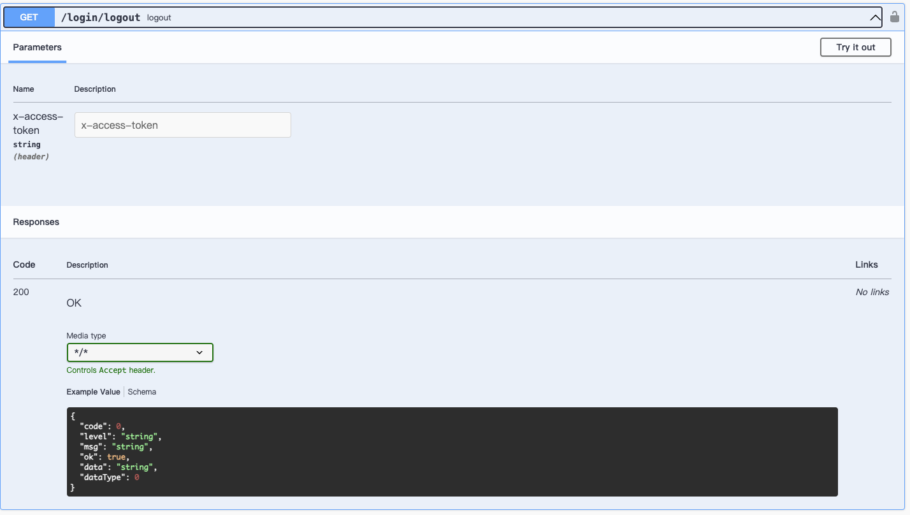
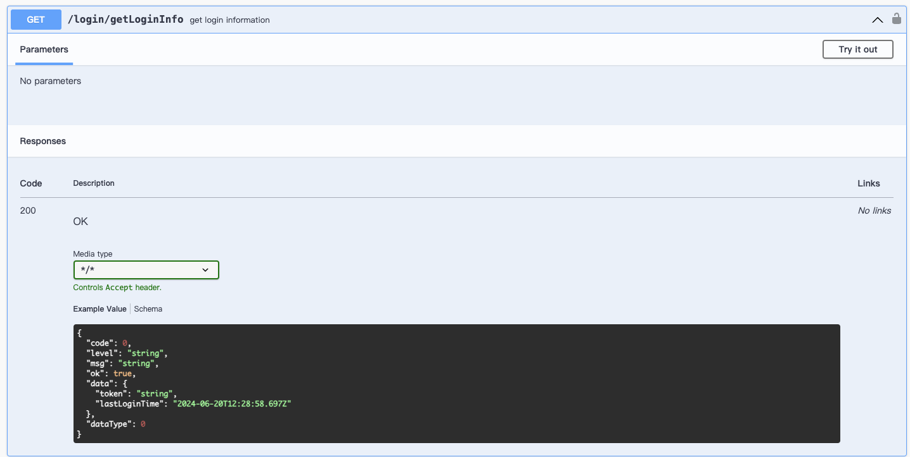
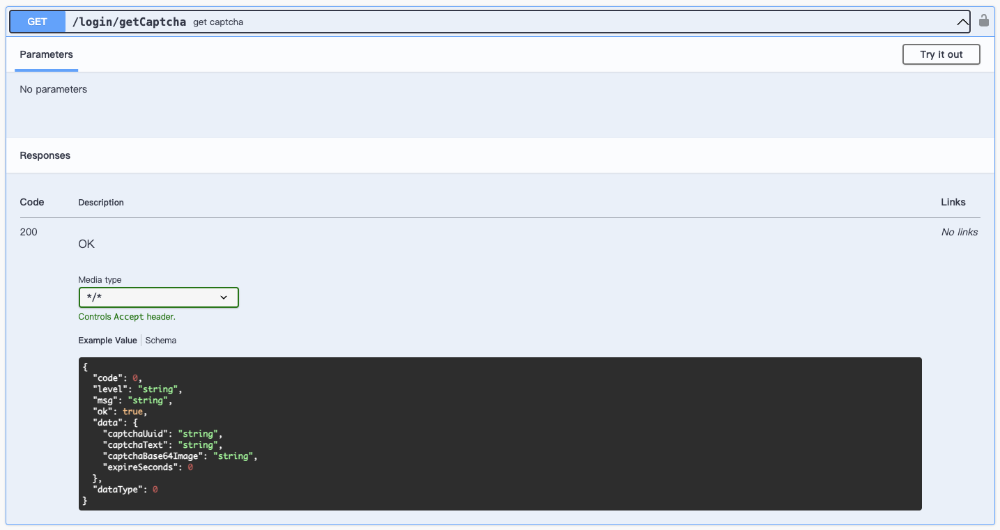
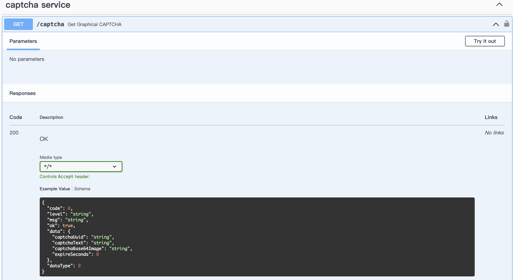

# Back-end API doc

## System Login

### Endpoint: `POST /login`

Description: Login

| Parameters       | **Type** | **Description** | **Example Value** |
| ---------------- | -------- | --------------- | ----------------- |
| **Request Body** |          |                 |                   |
| `captchaCode`    | `string` | Captcha code    | `"string"`        |
| `captchaUuid`    | `string` | Captcha UUID    | `"string"`        |
| `loginName`      | `string` | Login name      | `"string"`        |
| `password`       | `string` | Password        | `"string"`        |

#### Responses

| **Code** | **Description** | **Media Type** | **Example Value**                                                                                                                                          |
| -------- | --------------- | -------------- | ---------------------------------------------------------------------------------------------------------------------------------------------------------- |
| 200      | OK              | `*/*`          | `{ "code": 0, "level": "string", "msg": "string", "ok": true, "data": { "token": "string", "lastLoginTime": "2024-06-20T11:41:04.789Z" }, "dataType": 0 }` |

#### Response Schema

| **Field**            | **Type**  | **Description**            |
| -------------------- | --------- | -------------------------- |
| `code`               | `integer` | Response code              |
| `level`              | `string`  | Message level              |
| `msg`                | `string`  | Message text               |
| `ok`                 | `boolean` | Operation status           |
| `data`               | `object`  | Response data              |
| `data.token`         | `string`  | Authentication token       |
| `data.lastLoginTime` | `string`  | Last login time (ISO 8601) |
| `dataType`           | `integer` | Data type                  |

This table outlines the parameters and response structure for the `/login` endpoint.

### Endpoint: `GET /login/logout`

#### Description: Logout

| **Parameters**   | **Type** | **Description**       | **Example Value**     |
| ---------------- | -------- | --------------------- | --------------------- |
| `x-access-token` | `string` | Access token (header) | `"your_access_token"` |

#### Responses

| **Code** | **Description** | **Media Type** | **Example Value**                                                                                |
| -------- | --------------- | -------------- | ------------------------------------------------------------------------------------------------ |
| 200      | OK              | `*/*`          | `{ "code": 0, "level": "string", "msg": "string", "ok": true, "data": "string", "dataType": 0 }` |

#### Response Schema

| **Field**  | **Type**  | **Description**  |
| ---------- | --------- | ---------------- |
| `code`     | `integer` | Response code    |
| `level`    | `string`  | Message level    |
| `msg`      | `string`  | Message text     |
| `ok`       | `boolean` | Operation status |
| `data`     | `string`  | Response data    |
| `dataType` | `integer` | Data type        |

This table outlines the parameters and response structure for the `/login/logout` endpoint.

### Endpoint: `GET /login/getLoginInfo`

#### Description: Get Login Information

#### Parameters

No parameters

#### Responses

| **Code** | **Description** | **Media Type** | **Example Value**                                                                                                                                          |
| -------- | --------------- | -------------- | ---------------------------------------------------------------------------------------------------------------------------------------------------------- |
| 200      | OK              | `*/*`          | `{ "code": 0, "level": "string", "msg": "string", "ok": true, "data": { "token": "string", "lastLoginTime": "2024-06-20T12:08:40.097Z" }, "dataType": 0 }` |

#### Response Schema

| **Field**            | **Type**  | **Description**            |
| -------------------- | --------- | -------------------------- |
| `code`               | `integer` | Response code              |
| `level`              | `string`  | Message level              |
| `msg`                | `string`  | Message text               |
| `ok`                 | `boolean` | Operation status           |
| `data`               | `object`  | Response data              |
| `data.token`         | `string`  | Authentication token       |
| `data.lastLoginTime` | `string`  | Last login time (ISO 8601) |
| `dataType`           | `integer` | Data type                  |

This table outlines the parameters and response structure for the `/login/getLoginInfo` endpoint.

### Endpoint: `GET /login/getCaptcha`

#### Description: Get Captcha

#### Parameters

No parameters

#### Responses

| **Code** | **Description** | **Media Type** | **Example Value**                                                                                                                                                                                |
| -------- | --------------- | -------------- | ------------------------------------------------------------------------------------------------------------------------------------------------------------------------------------------------ |
| 200      | OK              | `*/*`          | `{ "code": 0, "level": "string", "msg": "string", "ok": true, "data": { "captchaUuid": "string", "captchaText": "string", "captchaBase64Image": "string", "expireSeconds": 0 }, "dataType": 0 }` |

#### Response Schema

| **Field**                 | **Type**  | **Description**              |
| ------------------------- | --------- | ---------------------------- |
| `code`                    | `integer` | Response code                |
| `level`                   | `string`  | Message level                |
| `msg`                     | `string`  | Message text                 |
| `ok`                      | `boolean` | Operation status             |
| `data`                    | `object`  | Response data                |
| `data.captchaUuid`        | `string`  | Captcha UUID                 |
| `data.captchaText`        | `string`  | Captcha text                 |
| `data.captchaBase64Image` | `string`  | Base64 encoded captcha image |
| `data.expireSeconds`      | `integer` | Expiration time in seconds   |
| `dataType`                | `integer` | Data type                    |

This table outlines the parameters and response structure for the `/login/getCaptcha` endpoint.

## Captcha Service

### Endpoint: `GET /captcha`

#### Description: Get Graphical CAPTCHA

#### Parameters

No parameters

#### Responses

| **Code** | **Description** | **Media Type** | **Example Value**                                                                                                                                                                                |
| -------- | --------------- | -------------- | ------------------------------------------------------------------------------------------------------------------------------------------------------------------------------------------------ |
| 200      | OK              | `*/*`          | `{ "code": 0, "level": "string", "msg": "string", "ok": true, "data": { "captchaUuid": "string", "captchaText": "string", "captchaBase64Image": "string", "expireSeconds": 0 }, "dataType": 0 }` |

#### Response Schema

| **Field**                 | **Type**  | **Description**              |
| ------------------------- | --------- | ---------------------------- |
| `code`                    | `integer` | Response code                |
| `level`                   | `string`  | Message level                |
| `msg`                     | `string`  | Message text                 |
| `ok`                      | `boolean` | Operation status             |
| `data`                    | `object`  | Response data                |
| `data.captchaUuid`        | `string`  | Captcha UUID                 |
| `data.captchaText`        | `string`  | Captcha text                 |
| `data.captchaBase64Image` | `string`  | Base64 encoded captcha image |
| `data.expireSeconds`      | `integer` | Expiration time in seconds   |
| `dataType`                | `integer` | Data type                    |

This table outlines the parameters and response structure for the `/captcha` endpoint.

